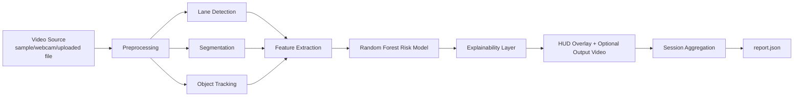
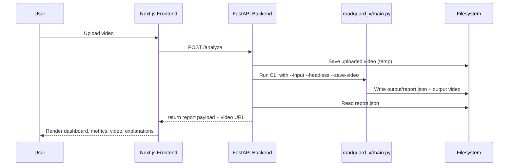

# RoadGuard-X: Full Project Context and Technical Deep Dive

## 1) What this project is

RoadGuard-X is an offline, explainable driving-scene risk analysis system. It combines:

- Classical computer vision (OpenCV)
- Lightweight machine learning (scikit-learn Random Forest)
- Temporal feature engineering over short frame windows
- Human-readable explainability outputs
- Optional API + web UI for upload and visualization

Core intent: provide a practical, reproducible, low-dependency system for evaluating driving risk trends from video without relying on cloud services or heavyweight deep-learning stacks.

---

## 2) High-level architecture



### Component map

- `roadguard_x/main.py`: orchestration loop, CLI, report writing, optional output video
- `roadguard_x/modules/preprocess.py`: frame enhancement (blur/CLAHE/gamma)
- `roadguard_x/modules/lane.py`: lane geometry extraction and lane offset estimation
- `roadguard_x/modules/segmentation.py`: K-means segmentation + morphological cleanup
- `roadguard_x/modules/tracker.py`: foreground tracking (MOG2 + contour-based tracking)
- `roadguard_x/modules/features.py`: engineered spatial/temporal feature vector
- `roadguard_x/modules/risk_model.py`: model loading and inference
- `roadguard_x/modules/explain.py`: reason generation and feature contribution formatting
- `roadguard_x/utils/hud.py`: visual overlays
- `roadguard_x/utils/reporter.py`: session-level metrics and JSON serialization
- `api/server.py`: optional FastAPI interface
- `web/app/page.tsx`: optional Next.js dashboard

---

## 3) Core pipeline behavior (CLI-first)

The CLI is the primary and canonical runtime path.

### Runtime flow

1. Select source (`--source sample|webcam`) or explicit file (`--input`).
2. Capture frame.
3. Preprocess frame for robustness.
4. Compute lane, segmentation, tracking primitives.
5. Build 9-feature vector from spatial + temporal cues.
6. Predict risk label using Random Forest.
7. Generate explanations (primary cause, reasons, contributions).
8. Render HUD.
9. Aggregate metrics into session stats.
10. Write `output/report.json` at end of run.

### Feature schema (from `modules/features.py`)

Fixed-order model features:

1. `lane_offset_norm`
2. `object_count`
3. `avg_object_area`
4. `edge_density`
5. `brightness`
6. `avg_speed`
7. `motion_variance`
8. `direction_consistency`
9. `scene_complexity_index`

`scene_complexity_index` (SCI) is a normalized custom metric combining edge density, object count, and motion variance.

---

## 4) Optional API + UI architecture



### Backend role (`api/server.py`)

- Provides health check
- Accepts uploaded video and invokes CLI
- Serves generated media under static route
- Returns report JSON payload to frontend
- Keeps pipeline logic centralized in CLI (no duplication)

### Frontend role (`web/app/page.tsx`)

- Handles file selection and drag/drop upload
- Displays upload/processing/done/error states
- Shows processed output video and analytical cards
- Renders reasons, top factors, metrics, and model card

---

## 5) What has been implemented so far

## Core analytics and model

- End-to-end CV + ML inference pipeline exists and runs from CLI.
- Session-level reporting is implemented and includes trend/stability/complexity.
- Explainability output includes:
  - reason list
  - primary cause
  - feature contributions
- Output persistence:
  - `output/report.json`
  - optional annotated output video

## Frontend UX state and dashboard improvements

Implemented in `web/app/page.tsx`:

- Explicit mutually-exclusive phases:
  - `uploading`
  - `processing`
  - `done`
  - `error`
- Status strip with smooth transitions and no layout thrash
- Accessible + automatable upload UX:
  - drag/drop zone
  - hidden but accessible file input + linked label
  - selected filename display
- Professional dashboard structure:
  - Processed Output section
  - Analysis Metrics section
  - Model Info section
- Large color-coded risk badge (HIGH/MEDIUM/LOW)
- Animated confidence progress bar
- Explanation panel split into:
  - Why this risk?
  - Top Factors
- Metric cards with consistent spacing and responsive layout

---

## 6) Latest observed results (from current report)

From `roadguard_x/output/report.json`:

- `total_frames`: 180
- `avg_objects`: 1.2333
- `risk_distribution`:
  - LOW: 97
  - MEDIUM: 74
  - HIGH: 9
- `lane_drift_events`: 26
- `scene_stability`: 0.1601
- `risk_trend`: decreasing
- `avg_scene_complexity`: 0.4850
- `top_features_global`:
  - lane_offset
  - avg_speed
  - object_density

Last-frame snapshot:

- risk: LOW
- confidence: 0.8158
- primary_cause: lane_drift
- reasons: sustained lane departure from center
- top contributions: lane_offset, avg_speed, object_density

---

## 7) Technical approaches and design choices

### Why classical CV + Random Forest

- Low compute requirements
- Deterministic, inspectable behavior
- Fast iteration for feature engineering
- Explainability-friendly compared to black-box-only pipelines

### Explainability strategy

- Keep model prediction and explanation close to same feature space
- Surface both:
  - rule-based textual reasons
  - compact quantitative feature contributions

### Offline-first reproducibility

- No cloud APIs
- Local model artifact in repo
- Runtime outputs deterministic per video/source settings

---

## 8) Current limitations and known gaps

- Foreground tracking does not provide semantic object classes.
- Classical lane/foreground methods are sensitive to low light, glare, and camera shake.
- Best results are on front-facing road video; edge cases need additional robustness.
- API/Frontend contract should remain synchronized with backend route/state design across branches.

---

## 9) Frontend roadmap: what can be done next

Practical high-value enhancements:

1. **Timeline analytics**
   - per-frame risk timeline chart
   - hover to jump video timestamp

2. **Reason drill-down**
   - per-reason frequency panel
   - contribution trend across session

3. **Session compare mode**
   - compare two runs (distribution, stability, trend)
   - baseline vs candidate analysis workflow

4. **Quality feedback**
   - ingest quality banner (too dark / too blurry)
   - confidence calibration hints

5. **Export UX**
   - one-click export of report + frame snapshots
   - downloadable summary markdown/pdf

6. **Operational polish**
   - retry flow for API errors/timeouts
   - resilient reconnect state when backend restarts
   - skeleton loaders for cards/video pane

7. **A11y and QA**
   - keyboard-first upload interactions
   - aria-live improvements for state changes
   - Playwright test suite for upload -> process -> render

---

## 10) Local run instructions (full stack)

## A) CLI (primary)

```bash
cd roadguard_x
pip install -r requirements.txt
python main.py --source sample
```

Useful options:

```bash
python main.py --source webcam
python main.py --input path/to/video.mp4 --headless --save-video
```

## B) Optional API

```bash
pip install -r api/requirements.txt
python -m uvicorn api.server:app --host 127.0.0.1 --port 8000
```

## C) Optional frontend

```bash
cd web
npm install
npx next dev -p 3000
```

Open: `http://localhost:3000`

---

## 11) Suggested evaluation checklist

- CLI runs on sample video and produces `report.json`
- HUD shows risk, confidence, and overlays in non-headless mode
- API accepts upload and returns report payload
- Frontend handles all states (uploading/processing/done/error)
- Processed video renders and metrics match report fields
- No crash during normal sample run

---

## 12) Summary

RoadGuard-X currently provides a complete offline pipeline from raw driving video to explainable risk analytics, with both CLI and optional web interfaces. The core implementation emphasizes clarity, reproducibility, and practical interpretability. The frontend is already strong for evaluator demos and can be extended next with timeline analytics, richer drill-down, and stronger automated test coverage.

