# RoadGuard-X — Context-Aware Driving Intelligence System

RoadGuard-X is an offline, explainable driving-scene risk analysis system. It combines classical OpenCV computer vision with a scikit-learn Random Forest to analyze driving video and output per-frame risk levels (LOW / MEDIUM / HIGH) along with human-readable explanations. The entire pipeline runs locally without cloud APIs or downloaded weights, and the pre-trained model artifact is committed to the repo.

## Features

- **Classical CV pipeline:** preprocessing, lane detection, K-means segmentation, MOG2 tracking
- **ML risk classifier:** Random Forest on 9 engineered features → LOW / MEDIUM / HIGH
- **Explainability:** rule-based reasons, primary cause, confidence, feature contributions
- **Model evaluation:** held-out test metrics, confusion matrix, classification report
- **CLI:** webcam, sample video, custom files, headless mode, danger clips, live HUD
- **REST API:** FastAPI upload + polling + artifact serving
- **Web dashboard:** Next.js UI with processed video, metrics, timeline, and model evaluation panel
- **Offline-first:** no GPU, no cloud inference, reproducible after clone

## Screenshots

Captured locally with the bundled `demo.mp4` (`roadguard_x/samples/demo.mp4`). **Web:** API `:8000` + UI `:3000` · **CLI:** `python roadguard_x/main.py --source sample`

### Dashboard

| Hero & model metrics | Upload |
|:---:|:---:|
| 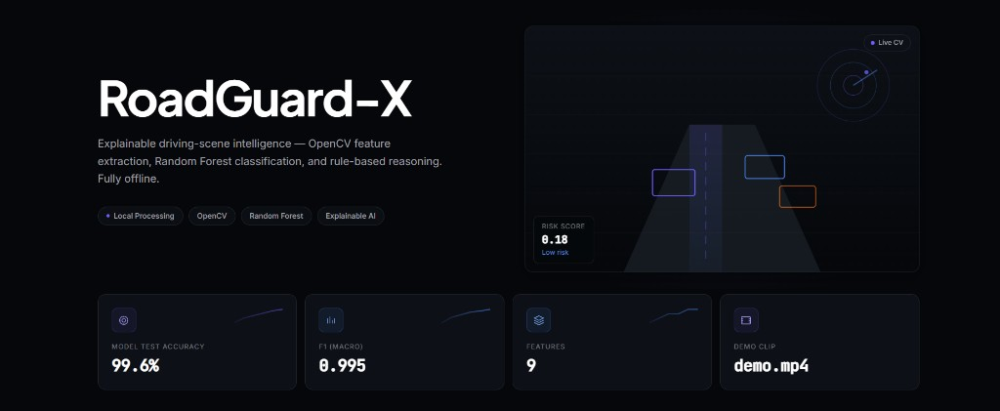 | 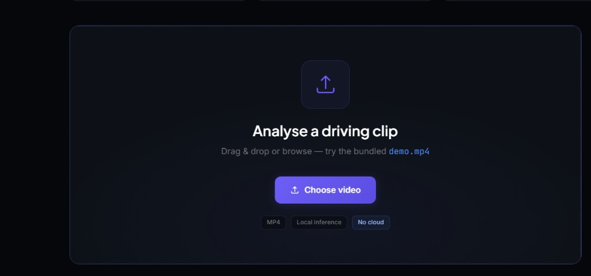 |

### Analysis results

| Processed output | Analysis metrics |
|:---:|:---:|
| 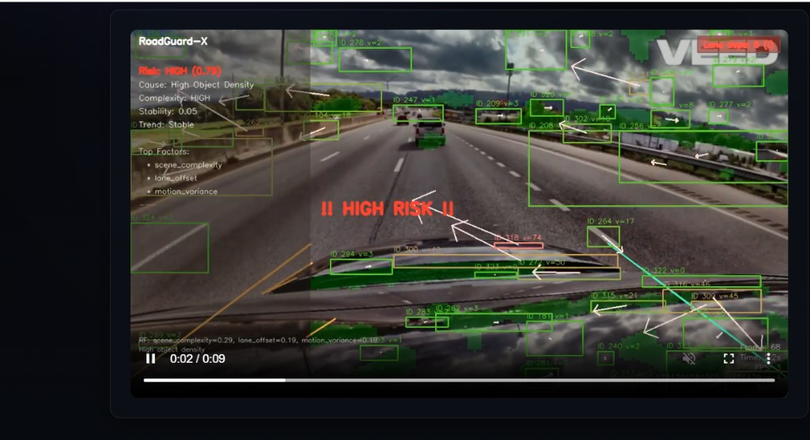 | 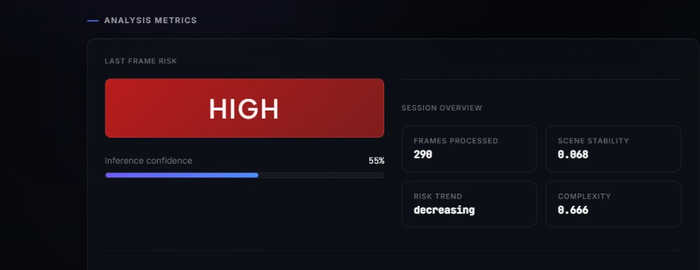 |

| Explainability |
|:---:|
| 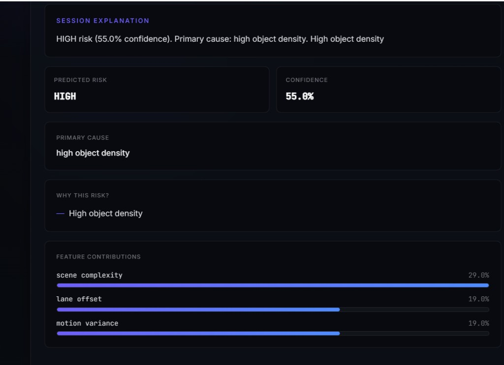 |

| Session summary & timeline | Danger clips & distribution |
|:---:|:---:|
| 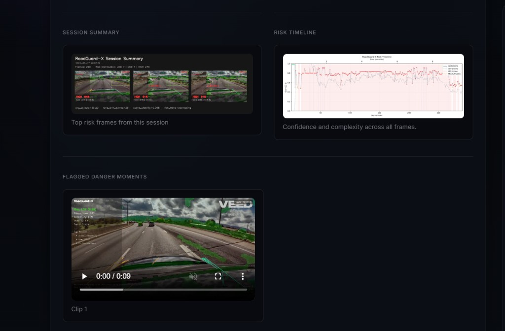 | 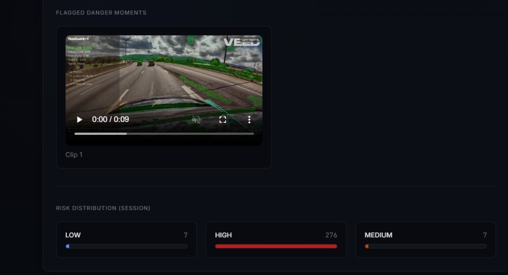 |

### Model evaluation

| Feature importances | Test metrics |
|:---:|:---:|
| 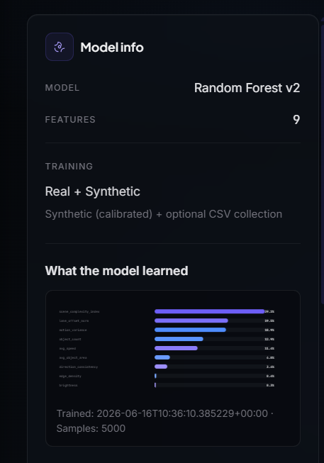 | 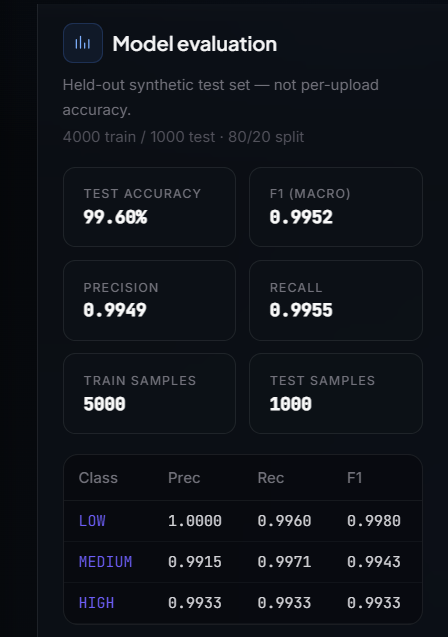 |

| Confusion matrix |
|:---:|
| 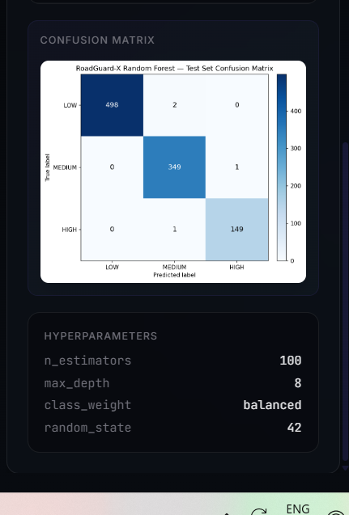 |

### CLI live HUD

| Terminal overlay |
|:---:|
| 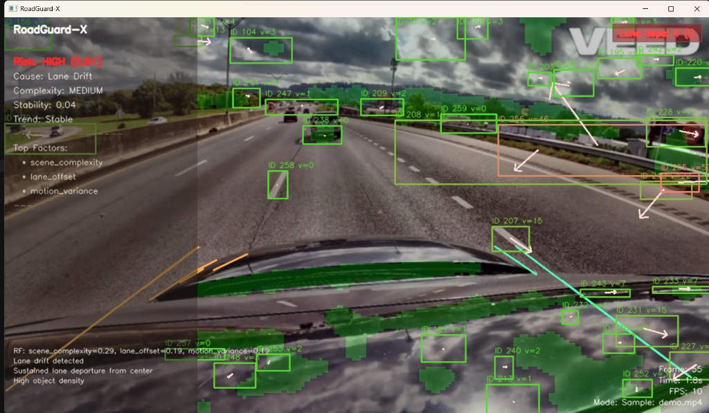 |

*Dashboard training metrics = held-out synthetic test set (not per-upload accuracy).*

## Table of contents

- [Features](#features)
- [Screenshots](#screenshots)
- [What it does](#what-it-does)
- [Results](#results)
- [Architecture overview](#architecture-overview)
- [Tech stack](#tech-stack)
- [Project structure](#project-structure)
- [FFmpeg (recommended for web playback)](#ffmpeg-recommended-for-web-playback)
- [Quick start (CLI)](#quick-start-cli)
- [Clone-friendly full stack run](#clone-friendly-full-stack-run)
- [CLI usage examples](#cli-usage-examples)
- [Keyboard controls during live display](#keyboard-controls-during-live-display)
- [Output files explained](#output-files-explained)
- [Optional api setup](#optional-api-setup)
- [Optional frontend setup](#optional-frontend-setup)
- [Model training](#model-training)
- [Testing and validation](#testing-and-validation)
- [Deployment](#deployment)
- [Known limitations](#known-limitations)
- [Course syllabus coverage](#course-syllabus-coverage)
- [License](#license)

## What it does

RoadGuard-X processes a video (webcam or file) frame by frame, detects lane structure and foreground motion, builds a fixed 9-feature vector per frame, and runs a Random Forest risk model to predict one of three risk labels: LOW, MEDIUM, or HIGH.

it is useful when you want interpretable, offline risk scoring from video without deploying heavy deep learning models. it also generates a structured JSON report and optional visual artifacts that summarize risk moments and feature importance.

Key outputs are written to `roadguard_x/output/`:

- `report.json` contains session-level metrics plus a `last_frame` snapshot (risk, confidence, primary cause, reasons, feature contributions).
- `summary.png` is a grid of the most dangerous frames (and a small fallback set if fewer HIGH frames exist).
- `risk_timeline.png` visualizes confidence and scene complexity over the full session, with lane departure events marked.
- `output/clips/clip_001.mp4`, `clip_002.mp4`, etc are extracted short clips around HIGH-risk moments when `--save-clips` is enabled.

## Results

Model evaluation metrics are produced by `roadguard_x/train_model.py` on a **held-out 20% test split** (stratified) and saved to `roadguard_x/models/training_metadata.json`. Visual artifacts are written to `roadguard_x/output/`.

Current Random Forest performance (synthetic training set, 5,000 samples):

- Random Forest trained on **5,000** synthetic samples (**4,000** train / **1,000** test)
- **9** engineered computer vision features
- **Accuracy:** 99.60%
- **Precision (macro):** 0.9949
- **Recall (macro):** 0.9955
- **F1-score (macro):** 0.9952
- Explainable **LOW / MEDIUM / HIGH** predictions with rule-based reasons and feature contributions
- Offline inference without cloud APIs

Per-class test F1: LOW 0.9980 · MEDIUM 0.9943 · HIGH 0.9933

Evaluation artifacts (after running `python train_model.py` from `roadguard_x/`):

- `roadguard_x/output/confusion_matrix.png`
- `roadguard_x/output/classification_report.txt`

Hyperparameters: `n_estimators=100`, `max_depth=8`, `class_weight=balanced`, `random_state=42`.

## Architecture overview

The pipeline runs inside the CLI entry point `roadguard_x/main.py`. the high-level stages are:

1. video input and frame capture (`open_capture` and the main loop)
2. preprocessing (`modules/preprocess.py` via `preprocess_frame`)
3. lane detection (`modules/lane.py` via `detect_lanes`)
4. segmentation (`modules/segmentation.py` via `kmeans_segment`)
5. object tracking (`modules/tracker.py` via `ObjectTracker.update`)
6. feature extraction (`modules/features.py` via `extract_combined`)
7. risk inference (`modules/risk_model.py` via `RiskModel.predict`)
8. explainability (`modules/explain.py` via `build_explanation`)
9. overlays and optional recording (`utils/hud.py` via `compose_frame`, plus OpenCV `VideoWriter`)
10. session aggregation and JSON reporting (`utils/reporter.py` via `SessionStats` and `write_report`)

optional integrations:

- `api/server.py` runs the same CLI pipeline as a subprocess for upload + polling, and serves generated artifacts.
- `web/app/page.tsx` uploads a video, polls the API, and renders the dashboard.

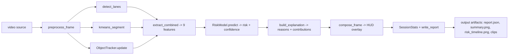

## Tech stack

### Core cli dependencies (roadguard_x/requirements.txt)

- `opencv-python`
- `numpy`
- `scikit-learn`
- `scipy`
- `matplotlib` (used for `risk_timeline.png`)
- `joblib` (model artifact load/save)

the repo uses lightweight, local-only dependencies and does not require GPU tooling.

### optional api dependencies (api/requirements.txt)

- `fastapi`
- `uvicorn`
- `python-multipart`

### optional frontend dependencies

- Next.js (Node 18+)
- React 18

### FFmpeg (recommended for web playback)

The pipeline records MP4 files with OpenCV using the `mp4v` codec, then **re-encodes them to H.264** (`libx264`) using **FFmpeg** so Chrome, Edge, and other browsers can play **processed output** and **flagged danger clips** reliably. If FFmpeg is not installed, files are still written, but playback in the browser often fails on other computers (black video, `0:00` duration, or no picture)—while the same project may appear to work on a machine that already had FFmpeg or different codecs installed.

**Install FFmpeg and confirm it is on your PATH before relying on the web dashboard or sharing runs with others.**

#### Windows (winget)

```powershell
winget install Gyan.FFmpeg
```

Close and reopen the terminal (and your IDE), then verify FFmpeg is visible to **new** processes:

```powershell
ffmpeg -version
where ffmpeg
```

You should see a version banner and a full path to `ffmpeg.exe`. If `where ffmpeg` prints nothing, winget may have installed FFmpeg but not updated PATH for your session—sign out and back in, or add the folder that contains `ffmpeg.exe` to your user PATH. After PATH works, **re-run analysis** so videos are re-encoded to H.264.

The API reports whether it can find FFmpeg: open `http://127.0.0.1:8000/health` and check `"ffmpeg_available": true`.

#### macOS (Homebrew)

```bash
brew install ffmpeg
ffmpeg -version
```

#### Linux (Debian/Ubuntu example)

```bash
sudo apt update && sudo apt install -y ffmpeg
ffmpeg -version
```

## Project structure

```text
roadguard_x/
├── main.py                        # CLI entry point
├── generate_sample.py             # optional: regenerate a synthetic clip locally
├── train_model.py                 # model training script (calibrated synthetic data)
├── models/
│   ├── risk_model.pkl             # pre-trained Random Forest (committed)
│   └── training_metadata.json    # feature importances, evaluation metrics (committed)
├── modules/
│   ├── preprocess.py              # preprocessing steps (blur, clahe, gamma)
│   ├── lane.py                    # lane detection + lane offset estimation
│   ├── segmentation.py           # k-means segmentation + morphological ops
│   ├── tracker.py                # mog2 background subtraction + contour tracking
│   ├── features.py               # 9-feature vector construction
│   ├── risk_model.py            # Random Forest inference
│   └── explain.py               # rule-based explainability
├── utils/
│   ├── hud.py                    # overlay drawing (lane overlay, tracks, status strip)
│   ├── reporter.py              # report.json serialization
│   ├── clip_writer.py           # danger clip extraction to output/clips/
│   ├── summary_frame.py         # summary.png generation
│   ├── timeline_chart.py         # risk_timeline.png generation
│   └── heatmap.py               # scene complexity heatmap overlay
├── samples/
│   └── demo.mp4                 # bundled short demo clip (use for CLI + localhost UI)
└── output/                       # created at runtime (or by train_model.py)
    ├── report.json
    ├── summary.png
    ├── risk_timeline.png
    ├── confusion_matrix.png      # model evaluation (train_model.py)
    ├── classification_report.txt # model evaluation (train_model.py)
    └── clips/

api/
└── server.py                      # FastAPI backend (upload, poll, serve artifacts)

web/
└── app/
    └── page.tsx                   # Next.js frontend dashboard
```

## Quick start (CLI)

Three commands after clone — uses the **bundled demo clip** (`roadguard_x/samples/demo.mp4`). No video generation step.

```bash
git clone https://github.com/username/roadguard-x.git
cd roadguard-x
pip install -r roadguard_x/requirements.txt
python roadguard_x/main.py --source sample
```

That runs the full pipeline on `samples/demo.mp4` and opens the live HUD. For a fast headless run (no window, writes `output/report.json`):

```bash
python roadguard_x/main.py --source sample --headless
```

Full artifact run (report + summary + timeline + annotated video + danger clips):

```bash
python roadguard_x/main.py --source sample --headless --save-video --save-clips
```

### Prerequisites

| Step | Command / note |
|------|----------------|
| **FFmpeg** (web UI video playback) | [Install FFmpeg](#ffmpeg-recommended-for-web-playback) — optional for CLI-only |
| **Demo clip** | Included at `roadguard_x/samples/demo.mp4` (~17 MB) |
| **Explicit file path** | `python roadguard_x/main.py --input roadguard_x/samples/demo.mp4 --headless` |

If `demo.mp4` is missing, optionally run `python roadguard_x/generate_sample.py` and rename the output to `demo.mp4`.

### expected output files

After the run finishes, verify these exist under:

```text
roadguard_x/output/
```

- `report.json`
- `summary.png`
- `risk_timeline.png`
- `output.mp4`
- `clips/clip_001.mp4` etc (if HIGH-risk segments were found)

## Clone-friendly full stack run (localhost dashboard)

Run the **web dashboard** locally and upload the bundled `demo.mp4`. Recommended for demos and README screenshots.

**Before the web UI will show processed output reliably, install FFmpeg** (see [FFmpeg](#ffmpeg-recommended-for-web-playback)). On Windows:

```powershell
winget install Gyan.FFmpeg
ffmpeg -version
```

### Terminal 1 — API

```bash
git clone https://github.com/username/roadguard-x.git
cd roadguard-x
pip install -r roadguard_x/requirements.txt
pip install -r api/requirements.txt
python -m uvicorn api.server:app --host 0.0.0.0 --port 8000
```

### Terminal 2 — frontend

```bash
cd web
npm install
npx next dev -p 3000
```

### Try it

1. Open **http://localhost:3000**
2. Upload **`roadguard_x/samples/demo.mp4`**
3. Wait for **Analysis Complete** — processed video, risk metrics, model evaluation

Or analyze from the CLI in a third terminal:

```bash
python roadguard_x/main.py --source sample --headless --save-video
```

### another computer on the same network (videos not playing)

If the dashboard works on your PC but a teammate sees **no video** (or API errors in the browser console), it is usually one of these:

1. **Wrong host in the browser** — If they open the app as `http://localhost:3000` on *their* laptop, `localhost` refers to *their* machine, not yours. They should use your LAN IP, e.g. `http://192.168.1.42:3000`. The frontend auto-picks the API at `http://<same-host>:8000` when `NEXT_PUBLIC_API_URL` is unset.
2. **API not listening on the LAN** — Use `--host 0.0.0.0` for uvicorn (above) and keep the firewall from blocking port 8000.
3. **FFmpeg missing** — Re-run analysis after installing FFmpeg so MP4s are re-encoded for the browser (see [FFmpeg (recommended for web playback)](#ffmpeg-recommended-for-web-playback)).
4. **Custom API port** — Set `NEXT_PUBLIC_API_URL` in `web/.env.local`, for example `NEXT_PUBLIC_API_URL=http://192.168.1.42:9000`.

## CLI usage examples

Use these commands from the repo root with your python environment active.

### 1) bundled demo clip (recommended)

```bash
python roadguard_x/main.py --source sample
```

Uses `roadguard_x/samples/demo.mp4` (included in the repo). Opens the live HUD with lane overlay and risk banner.

expected:

- HUD window (unless your environment is headless)
- `roadguard_x/output/report.json`, `summary.png`, and `risk_timeline.png`

note:

- `--source sample` uses the bundled clip `roadguard_x/samples/demo.mp4`. If it is missing, add the file or run `python generate_sample.py` and rename/copy the output to `demo.mp4`.

### 2) use webcam

```bash
python roadguard_x/main.py --source webcam
```

expected:

- a live OpenCV window
- if no webcam is available, the script falls back to the bundled sample video and continues

### 3) analyze a custom video file

```bash
python roadguard_x/main.py --input path/to/video.mp4 --headless
```

expected:

- no GUI window
- outputs written to `roadguard_x/output/`

### 4) headless processing (no OpenCV display)

```bash
python roadguard_x/main.py --source sample --headless
```

expected:

- no GUI
- still writes `report.json`, `summary.png`, and `risk_timeline.png`

### 5) save annotated output video

```bash
python roadguard_x/main.py --source sample --save-video
```

expected:

- `roadguard_x/output/output.mp4` created

### 6) extract danger clips (HIGH-risk moments)

```bash
python roadguard_x/main.py --source sample --save-clips
```

expected:

- `roadguard_x/output/clips/clip_001.mp4` etc (clip count depends on the run)

### 7) skip optional summary artifacts

```bash
python roadguard_x/main.py --source sample --no-summary --no-timeline
```

expected:

- `report.json` still generated
- `summary.png` and `risk_timeline.png` skipped

### 8) limit run length for quick testing

```bash
python roadguard_x/main.py --source sample --max-frames 120 --headless
```

expected:

- fast run
- report and (unless skipped) artifacts written for the processed frame count

## Keyboard controls during live display

These controls apply when the run is not `--headless` and the OpenCV window is active:

- `h`: toggle the scene complexity heatmap overlay
- `s`: save a single annotated frame image to `roadguard_x/output/frame_<frame>_<n>.jpg`
- `q`: quit the run and still write outputs (`report.json`, and any enabled artifacts)
- `r`: reset session stats (clears aggregated counters and buffers)
- `v`: toggle recording into `output/output.mp4`

## Output files explained

### output files per run

#### `roadguard_x/output/report.json`

This file is the authoritative structured report for the run.

report schema (types and meaning):

```json
{
  "summary": {
    "total_frames": 180,
    "avg_objects": 1.23,
    "risk_distribution": { "LOW": 97, "MEDIUM": 74, "HIGH": 9 },
    "lane_drift_events": 26,
    "avg_abs_lane_offset_norm": 0.1405,
    "scene_stability": 0.1601,
    "risk_trend": "decreasing",
    "avg_scene_complexity": 0.485,
    "top_features_global": ["lane_offset", "avg_speed", "object_density"],
    "danger_clips_saved": 3
  },
  "meta": {
    "source": "file" | "sample" | "webcam",
    "sample_file": "name.mp4" | null,
    "model": "models/risk_model.pkl",
    "frames_processed": 180,
    "dataset_appended": false,
    "video_saved": true,
    "last_frame": {
      "risk": "LOW" | "MEDIUM" | "HIGH",
      "confidence": 0.0,
      "primary_cause": "lane_drift" | "...",
      "reasons": ["..."],
      "feature_contributions": {
        "lane_offset": 0.29,
        "avg_speed": 0.27
      }
    }
  }
}
```

field descriptions:

- `summary.total_frames`: integer count of frames processed.
- `summary.avg_objects`: mean of per-frame tracked object counts.
- `summary.risk_distribution`: counts of predicted labels across frames.
- `summary.lane_drift_events`: count of frames that triggered the temporal lane drift condition.
- `summary.avg_abs_lane_offset_norm`: mean absolute value of `lane_offset_norm` over the run.
- `summary.scene_stability`: average of a derived stability signal computed from motion variance.
- `summary.risk_trend`: compares mean ordinal risk in the last vs previous windows.
- `summary.avg_scene_complexity`: mean scene complexity index (SCI).
- `summary.top_features_global`: most frequent top-3 feature names (short names) across frames.
- `summary.danger_clips_saved`: number of MP4 danger clips successfully written.
- `meta.last_frame`: snapshot from the final processed frame inside the main loop.

#### `roadguard_x/output/summary.png`

This is a CV-only summary image made with OpenCV drawing:

- header with session title and stats
- up to 3 thumbnails of the most dangerous frames found during the run
- each thumbnail includes an overlay bar with risk label, confidence, primary cause, and timestamp
- below thumbnails, a stats row includes `avg_objects`, `lane_drift_events`, `scene_stability`, `risk_trend`

#### `roadguard_x/output/risk_timeline.png`

This plot is generated by matplotlib:

- main plot: per-frame confidence values
- colored points reflect risk label at each frame
- dashed SCI line shows scene complexity over time
- shaded HIGH/MEDIUM zones indicate risk ranges
- vertical dashed lines mark lane drift event frames

#### `roadguard_x/output/clips/clip_###.mp4`

when `--save-clips` is enabled, the CLI extracts a clip around each HIGH-risk segment:

- a rolling pre-buffer of frames is stored (context window is derived from fps and the configured 2-second radius)
- the writer saves pre + HIGH frames + post buffer into `clip_001.mp4`, `clip_002.mp4`, etc

### how to interpret these outputs

- `risk_distribution` is a coarse session histogram.
- `last_frame.risk` and `last_frame.confidence` provide the end-of-session instantaneous model state.
- `primary_cause` and `reasons` provide rule-level context for why the model thinks this frame is high risk.
- `feature_contributions` are global feature importances ranked (Random Forest uses feature importances as a lightweight explanation proxy).

## Optional api setup

the API is optional. it provides upload + polling + artifact serving, and it runs the same CLI pipeline as a subprocess.

### step 1: install API dependencies

run from the repo root:

```bash
pip install -r api/requirements.txt
```

### step 2: start the backend

```bash
python -m uvicorn api.server:app --host 127.0.0.1 --port 8000
```

### step 3: confirm the bundled demo clip

The repo includes `roadguard_x/samples/demo.mp4`. No generation step is required.

### step 4: call the analysis endpoint

start the server, then upload the bundled demo clip:

```bash
curl -s -X POST -F "file=@roadguard_x/samples/demo.mp4" http://127.0.0.1:8000/analyze
```

expected response:

```json
{ "status": "processing" }
```

poll pipeline state:

```bash
curl -s http://127.0.0.1:8000/status
```

expected values:

- `{ "status": "processing" }` while running
- `{ "status": "done" }` on success
- `{ "status": "error", "message": "..." }` on failure

fetch the report payload:

```bash
curl -s http://127.0.0.1:8000/report
```

expected done shape (fields may include optional artifact URLs):

```json
{
  "status": "done",
  "video_url": "/files/output.mp4",
  "report": { "summary": { ... }, "meta": { ... } },
  "meta": { "frames": 180, "model": "Random Forest v2", "features": 9, "training_data": "..." },
  "summary_image_url": "/media/summary.png",
  "timeline_image_url": "/media/risk_timeline.png",
  "danger_clips": ["/media/clips/clip_001.mp4", "..."]
}
```

### model-info endpoint (feature importances + evaluation)

this endpoint is used by the frontend to visualize model feature importances and held-out test metrics:

```bash
curl -s http://127.0.0.1:8000/model-info
```

expected fields:

- `timestamp`
- `n_samples`
- `class_distribution` (LOW/MEDIUM/HIGH counts)
- `feature_importances` mapping feature_name -> importance_value
- `sklearn_version`
- `hyperparameters` (Random Forest settings)
- `train_test_split` (`n_train`, `n_test`, `test_size`, `stratify`)
- `evaluation` (`accuracy`, `precision_macro`, `recall_macro`, `f1_macro`, `per_class`, `confusion_matrix`)
- `confusion_matrix_url` (e.g. `/media/confusion_matrix.png` when the PNG exists in `output/`)
- `classification_report_url` (e.g. `/media/classification_report.txt` when present)

if the metadata file is missing, the server returns empty defaults.

### media route

the API serves all generated artifacts under:

- `http://127.0.0.1:8000/media/...`

For example:

- `http://127.0.0.1:8000/media/summary.png`
- `http://127.0.0.1:8000/media/risk_timeline.png`
- `http://127.0.0.1:8000/media/confusion_matrix.png` (after `train_model.py`)
- `http://127.0.0.1:8000/media/classification_report.txt` (after `train_model.py`)
- `http://127.0.0.1:8000/media/clips/clip_001.mp4`

## Optional frontend setup

the dashboard is optional. it uploads a video to the API, polls `/status`, then fetches `/report` and renders:

- `Processed Output`: the processed video player
- `Analysis Metrics`: risk badge, confidence bar, primary cause, explanation, and session metric tiles
- `Model Info`: feature-importance bar chart (inline SVG), training timestamp/sample count, and **model evaluation** metrics (accuracy, precision, recall, F1, confusion matrix) when `train_model.py` artifacts exist
- `Session summary`: `summary.png` when present in the API response
- `Risk timeline`: `risk_timeline.png` when present in the API response
- `Flagged danger moments`: extracted HIGH-risk clips when present in the API response

### step 1: start the frontend

from the repo root:

```bash
cd web
npm install
npx next dev -p 3000
```

### step 2: ensure API server and sample file are ready

in another terminal:

```bash
python -m uvicorn api.server:app --host 127.0.0.1 --port 8000
```

The bundled clip `roadguard_x/samples/demo.mp4` is included in the repo for uploads.

### step 3: open the dashboard

open:

```text
http://localhost:3000
```

### step 4: upload and run

- upload `roadguard_x/samples/demo.mp4`
- wait for `Analysis Complete`
- verify processed output video, summary image, timeline image, and danger clips

### if the API is on a different host/port

create `web/.env.local`:

```env
NEXT_PUBLIC_API_URL=http://127.0.0.1:8000
```

## Model training

the repo ships a pre-trained model artifact so evaluators can run inference immediately.

if you want to retrain the Random Forest from scratch, `roadguard_x/train_model.py` generates a fully synthetic training set, trains the classifier, and saves both the model artifact and training metadata used for explainability.

### what gets trained

- model: `RandomForestClassifier`
- objective: multi-class classification into LOW / MEDIUM / HIGH
- feature vector order is fixed by `roadguard_x/modules/features.py` and matches inference
- training data is generated synthetically with realistic feature relationships, then noise-perturbed

the training script creates exactly `n_samples=5000` by default with class priors:

- 50% LOW
- 35% MEDIUM
- 15% HIGH

### the 9 features used by the model

feature names match `roadguard_x/modules/features.py` `FEATURE_NAMES` order:

1. `lane_offset_norm` — normalized lateral distance from lane center
2. `object_count` — number of tracked foreground objects
3. `avg_object_area` — average contour area of tracked objects
4. `edge_density` — proportion of edge pixels in the frame ROI
5. `brightness` — mean frame brightness normalized to 0–1
6. `avg_speed` — average displacement magnitude between frames
7. `motion_variance` — variance of motion across the rolling frame buffer
8. `direction_consistency` — consistency of motion directions across objects
9. `scene_complexity_index` (SCI) — computed in code as a normalized weighted mix of edge density + object count + motion variance, then clamped to [0, 1]

in `roadguard_x/modules/features.py`, SCI is computed as:

- raw = `0.5 * edge_density + 0.3 * object_count + 0.2 * motion_variance`
- sci = `raw / _SCI_DENOM`, where `_SCI_DENOM` is a fixed heuristic scale
- final = clamp(sci, 0, 1)

### how to retrain from scratch

run:

```bash
cd roadguard_x
python train_model.py
```

expected behavior:

- it generates 5000 synthetic samples by sampling feature ranges per class bucket (LOW / MEDIUM / HIGH)
- it adds Gaussian noise per feature to avoid perfectly separable clusters
- it clips normalized features back into `[0, 1]` (and clips `object_count` into `[0, +inf)`)
- it splits data **80% train / 20% test** (stratified, `random_state=42`)
- it trains a Random Forest with: `n_estimators=100`, `max_depth=8`, `class_weight='balanced'`, `random_state=42`
- it prints classification reports for **train** and **held-out test** sets, plus feature importances
- it saves `roadguard_x/models/risk_model.pkl` and `roadguard_x/models/training_metadata.json` (includes accuracy, precision, recall, F1, confusion matrix, hyperparameters)
- it writes evaluation artifacts to `roadguard_x/output/confusion_matrix.png` and `roadguard_x/output/classification_report.txt`

what gets saved in `risk_model.pkl`:

- a joblib payload with keys: `classifier`, `feature_names`, `scaler`, `schema_version`, `trained_on_real`

### interpreting classification report output

the script prints:

- a “classification report (train set)” for LOW / MEDIUM / HIGH
- a “classification report (held-out test set)” for LOW / MEDIUM / HIGH
- test-set summary metrics: accuracy, precision (macro), recall (macro), F1 (macro)
- “feature importances” ranked by the trained forest

if the synthetic relationships are internally consistent, you should see strong precision/recall for both train and test sets.

the frontend uses `training_metadata.json` and `/model-info` to visualize feature importances and model evaluation metrics (when artifacts exist).

## Testing and validation

This section lists every test in a numbered list with exact commands and exact checks.

### a) environment check

run from the repo root:

```bash
python -c "import cv2, numpy as np, sklearn, scipy, matplotlib, joblib; from roadguard_x.modules.risk_model import RiskModel; m=RiskModel(); print('imports_ok'); print('model_loaded', type(m).__name__)"
```

what to verify:

1. the script prints `imports_ok`
2. it prints `model_loaded RiskModel`
3. it does not raise import or file-not-found errors

also verify model artifact exists:

```bash
test -f roadguard_x/models/risk_model.pkl && echo "risk_model.pkl exists"
test -f roadguard_x/models/training_metadata.json && echo "training_metadata.json exists"
```

### b) CLI smoke test (minimal headless)

```bash
python roadguard_x/main.py --source sample --headless --max-frames 30 --no-summary --no-timeline
```

what to verify:

1. `roadguard_x/output/report.json` is created
2. the report JSON contains a top-level `summary` object and a top-level `meta` object
3. `summary.total_frames` is `<= 30` and should be close to 30

verification commands:

```bash
test -s roadguard_x/output/report.json && echo "report.json non-empty"
python -c "import json; d=json.load(open('roadguard_x/output/report.json')); print('keys', sorted(d.keys())); print('total_frames', d['summary']['total_frames']);"
```

### c) CLI full output test (all outputs enabled)

```bash
python roadguard_x/main.py --source sample --headless --max-frames 180
```

what to verify:

1. `roadguard_x/output/report.json` exists and is non-empty
2. `roadguard_x/output/summary.png` exists and is non-empty
3. `roadguard_x/output/risk_timeline.png` exists and is non-empty
4. `roadguard_x/output/clips/` exists (may be empty if no HIGH moments occur)

verification commands:

```bash
test -s roadguard_x/output/report.json && echo "report.json ok"
test -s roadguard_x/output/summary.png && echo "summary.png ok"
test -s roadguard_x/output/risk_timeline.png && echo "risk_timeline.png ok"
test -d roadguard_x/output/clips && echo "clips dir ok"
```

### d) report.json validation (types, ranges, exact checks)

expected field-by-field schema:

- `summary.total_frames`: integer, must be `> 0`. correct: `180` for a full run.
- `summary.avg_objects`: number (float), must be `>= 0`. correct: mean tracked objects per frame.
- `summary.risk_distribution`: object with exactly these keys `LOW`, `MEDIUM`, `HIGH`, each value is an integer count `>= 0` and the counts sum to `summary.total_frames`. correct: `{"LOW": 97, "MEDIUM": 74, "HIGH": 9}` where sum is `180`.
- `summary.lane_drift_events`: integer `>= 0`. correct: `26` lane drift frames (or fewer when truncated by `--max-frames`).
- `summary.avg_abs_lane_offset_norm`: float in `[0, 1]`. correct: near `0.0` when lane offset stays near center; near `1.0` when offset is large.
- `summary.scene_stability`: float in `[0, 1]`. correct: closer to `1.0` for stable motion (low variance).
- `summary.risk_trend`: string in `{"increasing","decreasing","stable"}`. correct: `decreasing` when recent risk is lower than earlier risk.
- `summary.avg_scene_complexity`: float in `[0, 1]`. correct: 0.0..1.0 SCI mean.
- `summary.top_features_global`: array of short feature-name strings (up to 5). correct: values like `lane_offset`, `avg_speed`, `object_density`, `scene_complexity`.
- `summary.danger_clips_saved`: integer `>= 0`. correct: `0` when no HIGH segments were found for the clip writer.
- `meta.source`: string (typically `file`, `sample`, or `webcam`).
- `meta.sample_file`: string or `null`.
- `meta.model`: string path to the model artifact (e.g. `models/risk_model.pkl`).
- `meta.frames_processed`: integer. correct: equals `summary.total_frames`.
- `meta.dataset_appended`: boolean.
- `meta.video_saved`: boolean.
- `meta.last_frame.risk`: string in `{"LOW","MEDIUM","HIGH"}`.
- `meta.last_frame.confidence`: float in `[0, 1]`.
- `meta.last_frame.primary_cause`: string.
- `meta.last_frame.reasons`: array of strings.
- `meta.last_frame.feature_contributions`: object mapping short feature names to float importance values (typically `0.0..1.0`, rounded to 2 decimals in `modules/explain.py`).

run:

```bash
python - <<'PY'
import json
from pathlib import Path

p = Path("roadguard_x/output/report.json")
d = json.loads(p.read_text(encoding="utf-8"))

summary = d["summary"]
meta = d["meta"]

required_summary_keys = [
  "total_frames",
  "avg_objects",
  "risk_distribution",
  "lane_drift_events",
  "avg_abs_lane_offset_norm",
  "scene_stability",
  "risk_trend",
  "avg_scene_complexity",
  "top_features_global",
  "danger_clips_saved",
]

for k in required_summary_keys:
  assert k in summary, f"missing summary.{k}"

assert isinstance(summary["total_frames"], int)
assert summary["total_frames"] > 0

rd = summary["risk_distribution"]
assert set(rd.keys()) == {"LOW","MEDIUM","HIGH"}
assert sum(int(rd[k]) for k in rd) == summary["total_frames"]

assert isinstance(summary["lane_drift_events"], int)
assert summary["lane_drift_events"] >= 0

assert 0.0 <= float(summary["avg_abs_lane_offset_norm"]) <= 1.0
assert 0.0 <= float(summary["scene_stability"]) <= 1.0
assert summary["risk_trend"] in ("increasing","decreasing","stable")
assert 0.0 <= float(summary["avg_scene_complexity"]) <= 1.0

top_feats = summary["top_features_global"]
assert isinstance(top_feats, list)

assert isinstance(summary["danger_clips_saved"], int)
assert summary["danger_clips_saved"] >= 0

required_meta_keys = ["source","model","frames_processed","dataset_appended","video_saved","last_frame"]
for k in required_meta_keys:
  assert k in meta, f"missing meta.{k}"

assert isinstance(meta["frames_processed"], int)
assert meta["frames_processed"] == summary["total_frames"]
assert isinstance(meta["last_frame"], dict)
lf = meta["last_frame"]

assert lf["risk"] in ("LOW","MEDIUM","HIGH")
assert 0.0 <= float(lf["confidence"]) <= 1.0
assert isinstance(lf["primary_cause"], str)
assert isinstance(lf["reasons"], list)
assert isinstance(lf["feature_contributions"], dict)

print("report_json_validation_passed")
PY
```

what to verify:

1. the script prints `report_json_validation_passed`
2. the JSON contains every required key listed above

### e) summary.png visual validation

open:

```text
roadguard_x/output/summary.png
```

what to look for:

1. header text “RoadGuard-X Session Summary”
2. the risk distribution text line containing LOW / MED / HIGH counts
3. exactly up to three thumbnails side by side (if fewer than three HIGH frames exist, medium frames are used as fallback)
4. each thumbnail has a bottom semi-transparent bar containing risk label, confidence %, primary cause, and timestamp
5. the bottom row includes `avg_objects`, `lane_drift_events`, `scene_stability`, and `risk_trend`

what correct vs broken looks like:

- correct: thumbnails are not blank, and the overlay bars are visible and readable.
- broken: image is black/empty, thumbnails are missing, or text overlays are clipped or absent.

### f) risk_timeline.png visual validation

open:

```text
roadguard_x/output/risk_timeline.png
```

what to look for:

1. title “RoadGuard-X Risk Timeline”
2. confidence line or points across the frame indices
3. SCI dashed line visible
4. shaded HIGH zones (light red) and MEDIUM zones (light orange)
5. vertical dashed lines at lane drift event frames

what correct vs broken looks like:

- correct: axis labels and legend are present and interpretable, and the HIGH/MEDIUM shading aligns with the colored points.
- broken: empty plot area, missing legend, or a crash-generated zero-byte file.

### g) live display test (non-headless)

run:

```bash
python roadguard_x/main.py --source sample --max-frames 240
```

what to verify:

1. the OpenCV window opens
2. HUD overlay shows lanes and tracked motion boxes/arrows
3. the risk banner updates over time
4. heatmap toggle works: press `h` once and verify the scene complexity heatmap overlay changes (the terminal prints `Heatmap ON`), then press `h` again and verify the overlay returns to normal (terminal prints `Heatmap OFF`).
5. lane departure counter: verify a “Lane deps: N” pill is visible at the top-right, and verify it becomes highlighted (red state and “(!)” suffix) when a new departure is detected.

how to exit:

- press `q` to quit and force output generation

### h) webcam test

run:

```bash
python roadguard_x/main.py --source webcam --max-frames 240
```

what to verify:

1. if a webcam exists, you see live frames and HUD updates
2. if the webcam fails to open, the script prints a fallback message and processes the bundled sample instead
3. outputs are still written at the end of the run (report at minimum)

### i) api health check

from repo root (API server must be running):

```bash
curl -s http://127.0.0.1:8000/health
```

expected response fields:

- `status`: `ok`
- `cwd`: path to the repo’s `roadguard_x/` root
- `model_exists`: true
- `samples_available`: true

### j) api model-info check

```bash
curl -s http://127.0.0.1:8000/model-info
```

expected response fields:

- `timestamp` (ISO string)
- `n_samples` (5000 for default training)
- `class_distribution` with numeric counts for LOW / MEDIUM / HIGH
- `feature_importances` is a mapping from feature name to a float importance
- `sklearn_version` is present

what to verify:

1. `n_samples` equals 5000
2. `feature_importances` contains keys for all 9 features from `FEATURE_NAMES`

### k) api analyze endpoint test

1. start api:

```bash
python -m uvicorn api.server:app --host 127.0.0.1 --port 8000
```

2. start analysis:

```bash
curl -s -X POST -F "file=@roadguard_x/samples/demo.mp4" http://127.0.0.1:8000/analyze
```

expected:

```json
{ "status": "processing" }
```

3. poll:

```bash
curl -s http://127.0.0.1:8000/status
```

expected:

- status becomes `done` (or `error`)

4. fetch report:

```bash
curl -s http://127.0.0.1:8000/report
```

expected done response shape:

```json
{
  "status":"done",
  "video_url": "/files/output.mp4",
  "report": { "summary": { ... }, "meta": { ... } },
  "meta": { "frames": 180, "model": "Random Forest v2", "features": 9, "training_data": "..." },
  "summary_image_url": "/media/summary.png",
  "timeline_image_url": "/media/risk_timeline.png",
  "danger_clips": ["/media/clips/clip_001.mp4", "..."]
}
```

### l) media serving test

while api server is running and after a completed run:

1. verify summary image:

```bash
curl -I http://127.0.0.1:8000/media/summary.png
```

what to verify:

- `HTTP/1.1 200 OK`
- `content-type` looks like `image/png`

2. verify timeline:

```bash
curl -I http://127.0.0.1:8000/media/risk_timeline.png
```

3. verify clips (only if clips exist):

```bash
curl -I http://127.0.0.1:8000/media/clips/clip_001.mp4
```

expected: 200 only if clip_001 exists.

### m) frontend end-to-end test

do the following steps:

1. start api server (terminal 1):

```bash
python -m uvicorn api.server:app --host 127.0.0.1 --port 8000
```

2. start frontend (terminal 2):

```bash
cd web
npx next dev -p 3000
```

3. open browser:

```text
http://localhost:3000
```

4. upload: use the “choose video” button or drag-and-drop, then select `roadguard_x/samples/demo.mp4`.

5. verify UI states: “Uploading video...” appears immediately, then spinner + “Analyzing...” appears while processing, then “Analysis Complete” appears when the API reports `done`; on error (upload a non-video file or start a second analysis while one is running), a red alert box appears with the message.

6. verify dashboard sections rendered after done: “Processed Output” video plays; “Analysis Metrics” shows risk badge, confidence bar, primary cause, explanation, session overview cards, and risk distribution tiles; “Model Info” shows the feature importance SVG chart and training timestamp/sample count; if artifacts exist in API response, “Session summary” image and “Risk timeline” image appear, and “Flagged danger moments” shows one HTML5 video element per clip.

### n) model sanity check (predictions with hand-crafted vectors)

run this python snippet from the repo root:

```bash
python -c "import numpy as np; from roadguard_x.modules.risk_model import RiskModel; m=RiskModel(); low=np.array([0.10,1.0,0.10,0.30,0.60,0.15,0.10,0.85,0.20],dtype=np.float64); med=np.array([0.30,3.0,0.30,0.45,0.65,0.35,0.35,0.60,0.45],dtype=np.float64); high=np.array([0.60,7.0,0.60,0.70,0.40,0.80,0.80,0.20,0.85],dtype=np.float64); label,conf,top=m.predict(low); print('LOW ->',label,'conf',round(conf,4)); label,conf,top=m.predict(med); print('MEDIUM ->',label,'conf',round(conf,4)); label,conf,top=m.predict(high); print('HIGH ->',label,'conf',round(conf,4))"
```

expected output (values may vary slightly by sklearn patch version, but labels should match):

```text
LOW -> LOW conf 0.9984
MEDIUM -> MEDIUM conf 0.9819
HIGH -> HIGH conf 0.9992
```

what to verify:

1. each input vector maps to the corresponding label
2. confidence is always above 0.9 for these deterministic vectors

### o) clip extraction validation

run:

```bash
python roadguard_x/main.py --source sample --headless --max-frames 240 --save-clips
```

what to verify:

1. `roadguard_x/output/clips/` exists
2. `roadguard_x/output/report.json` contains `summary.danger_clips_saved` with the number of MP4 clips written
3. the directory contains `clip_*.mp4` if `danger_clips_saved > 0`

verification commands:

```bash
python -c "import json; d=json.load(open('roadguard_x/output/report.json')); print('danger_clips_saved', d['summary']['danger_clips_saved'])"
ls -l roadguard_x/output/clips
```

if clips folder is empty:

- check that the run actually hit HIGH-risk moments (inspect `report.json.summary.risk_distribution`)
- optionally increase the run length with `--max-frames` so you capture more behavior

## Deployment

RoadGuard-X has three runnable parts: **CLI** (`roadguard_x/`), **API** (`api/`), and **web UI** (`web/`). For campus demos, local/LAN is the most reliable option. For a public portfolio link, deploy the frontend and API separately.

### What is committed vs generated

| Path | In git? | Notes |
|------|---------|--------|
| `roadguard_x/models/risk_model.pkl` | Yes | Pre-trained model |
| `roadguard_x/models/training_metadata.json` | Yes | Metrics for README + dashboard |
| `roadguard_x/output/*` | No (gitignored) | Created per run; run `train_model.py` locally for `confusion_matrix.png` |
| `roadguard_x/samples/demo.mp4` | Yes | Bundled short demo clip for CLI + localhost UI |

### Option A — Local / LAN demo (recommended for interviews)

Use [Clone-friendly full stack run](#clone-friendly-full-stack-run). Bind API and Next.js to `0.0.0.0` so teammates can open `http://<your-LAN-IP>:3000`.

### Option B — Deploy frontend (Vercel / Netlify)

1. Push this repo to GitHub.
2. Create a new project with **root directory** `web/`.
3. Framework: **Next.js** (default build: `npm run build`).
4. Set environment variable:

```env
NEXT_PUBLIC_API_URL=https://your-api-host.example.com
```

5. Deploy. The UI will call your hosted API for upload, status, report, and `/model-info`.

Copy `web/.env.example` to `web/.env.local` for local development with a custom API URL.

### Option C — Deploy API (Render, Railway, Fly.io, VPS)

1. Use the **repository root** as the app root (not `roadguard_x/` alone).
2. Install dependencies:

```bash
pip install -r roadguard_x/requirements.txt
pip install -r api/requirements.txt
```

3. Install **FFmpeg** on the server (`ffmpeg` on `PATH`) so processed MP4s play in browsers.
4. Start command (adjust port for your host):

```bash
python -m uvicorn api.server:app --host 0.0.0.0 --port 8000
```

5. Ensure the host allows long-running requests (video analysis can take several minutes).
6. Add your frontend origin to CORS in `api/server.py` (`allow_origins` or `allow_origin_regex`) — e.g. `https://your-app.vercel.app`.

Health check: `GET /health` → `ffmpeg_available: true` before relying on browser video playback.

### Deployment checklist

- [ ] `roadguard_x/samples/demo.mp4` present (bundled in repo)
- [ ] `python train_model.py` on any machine that should show the confusion matrix image
- [ ] FFmpeg installed where the **API** runs
- [ ] `NEXT_PUBLIC_API_URL` points to the live API
- [ ] CORS allows your frontend domain
- [ ] Smoke test: upload sample video → dashboard shows metrics + model evaluation

### Resume / portfolio one-liner

> Offline driving-risk analyzer: OpenCV feature pipeline + Random Forest classifier, FastAPI backend, Next.js dashboard with explainability and held-out model evaluation (99.6% accuracy on synthetic test set).

## Known limitations

- without **FFmpeg** on `PATH`, generated MP4s may not play in browsers on all systems; install FFmpeg so the pipeline can re-encode to H.264 (see [FFmpeg (recommended for web playback)](#ffmpeg-recommended-for-web-playback))
- lane detection and lane offset are heuristic-based and sensitive to lighting, camera shake, and ROI geometry
- motion segmentation does not provide object class names; tracked regions are foreground blobs
- initial MOG2 frames may be noisy until the background model stabilizes
- the synthetic risk model is calibrated for internally consistent feature relationships; real-world performance depends on dataset match
- heatmap overlay is a visual aid and not a precise causal proof of the model’s decision

## Course syllabus coverage

The table below maps high-level course modules to specific files and functions in this repo.

| course module | specific files and functions |
|---|---|
| Image Formation & Processing | `roadguard_x/modules/preprocess.py` (`preprocess_frame`, `gaussian_blur`, `apply_clahe`, `gamma_correction`) |
| Image Transformation & Morphological Operations | `roadguard_x/modules/segmentation.py` (`kmeans_segment`, `watershed_refine`) and `roadguard_x/utils/hud.py` (`draw_segmentation_overlay`) |
| Edge & Corner Detection & Hough Transform | `roadguard_x/modules/lane.py` (`detect_lanes`) |
| Image Segmentation & Clustering | `roadguard_x/modules/segmentation.py` (`kmeans_segment`) |
| Object Detection Tracking & Classification | `roadguard_x/modules/tracker.py` (`ObjectTracker.update`), `roadguard_x/modules/features.py` (`extract_combined`, `compute_scene_complexity_index`, `direction_consistency_from_tracks`), `roadguard_x/modules/risk_model.py` (`RiskModel.predict`), `roadguard_x/modules/explain.py` (`build_explanation`) |

## License

MIT license.

```text
MIT License

Copyright (c) 2026

Permission is hereby granted, free of charge, to any person obtaining a copy
of this software and associated documentation files (the "Software"), to deal
in the Software without restriction, including without limitation the rights
to use, copy, modify, merge, publish, distribute, sublicense, and/or sell
copies of the Software, and to permit persons to whom the Software is
furnished to do so, subject to the following conditions:

The above copyright notice and this permission notice shall be included in all
copies or substantial portions of the Software.

THE SOFTWARE IS PROVIDED "AS IS", WITHOUT WARRANTY OF ANY KIND, EXPRESS OR
IMPLIED, INCLUDING BUT NOT LIMITED TO THE WARRANTIES OF MERCHANTABILITY,
FITNESS FOR A PARTICULAR PURPOSE AND NONINFRINGEMENT. IN NO EVENT SHALL THE
AUTHORS OR COPYRIGHT HOLDERS BE LIABLE FOR ANY CLAIM, DAMAGES OR OTHER
LIABILITY, WHETHER IN AN ACTION OF CONTRACT, TORT OR OTHERWISE, ARISING FROM,
OUT OF OR IN CONNECTION WITH THE SOFTWARE OR THE USE OR OTHER DEALINGS IN THE
SOFTWARE.
```

